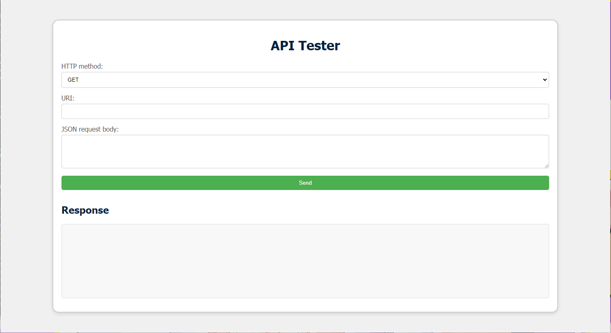

# Java Project: Spring Boot RESTful API
This project is a Spring Boot-based web application that demonstrates how to create a RESTful API for managing modules. The application uses Spring Data JPA for data persistence, with an H2 in-memory database for development and testing purposes.


## Table of Contents

- [Installation](#installation)
- [Configuration](#configuration)
- [Running the Application](#running-the-application)
- [API Endpoints](#api-endpoints)
- [Testing the API](#testing-the-api)
- [Project Structure](#project-structure)
- [Dependencies](#dependencies)
- [Contributing](#contributing)
- [License](#license)

## Installation
To get started with the project, you need to have the following installed on your machine:

- Java Development Kit (JDK) 11 or higher
- Maven 3.6.0 or higher

## Configuration
The application is configured to use an H2 in-memory database by default. The configuration is set in the application.properties file:

## Running the Application
You can run the application using Maven. Navigate to the project directory and execute the following command:

```bash
mvn spring-boot:run
```
The application will start, and you can access it at http://localhost:8080.

## API Endpoints

The application exposes several RESTful API endpoints for managing modules:
```bash
* **GET /api/modules**: Retrieve a list of all modules.
* **GET /api/modules/{id}**: Retrieve a specific module by its ID.
* **POST /api/modules**: Create a new module.
* **PUT /api/modules/{id}**: Update an existing module.
* **DELETE /api/modules/{id}**: Delete a module by its ID.
```
## Dependencies

The project uses the following dependencies:

* Spring Boot Starter Web
* Spring Boot Starter Data JPA
* H2 Database
* Spring Boot Starter Test
* JUnit Jupiter API and Engine
